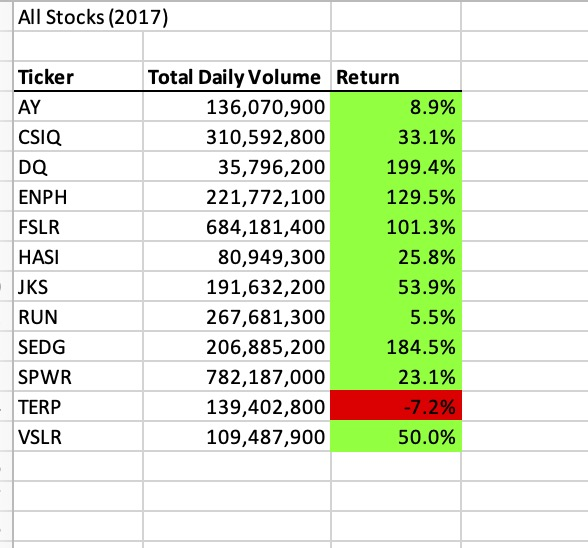
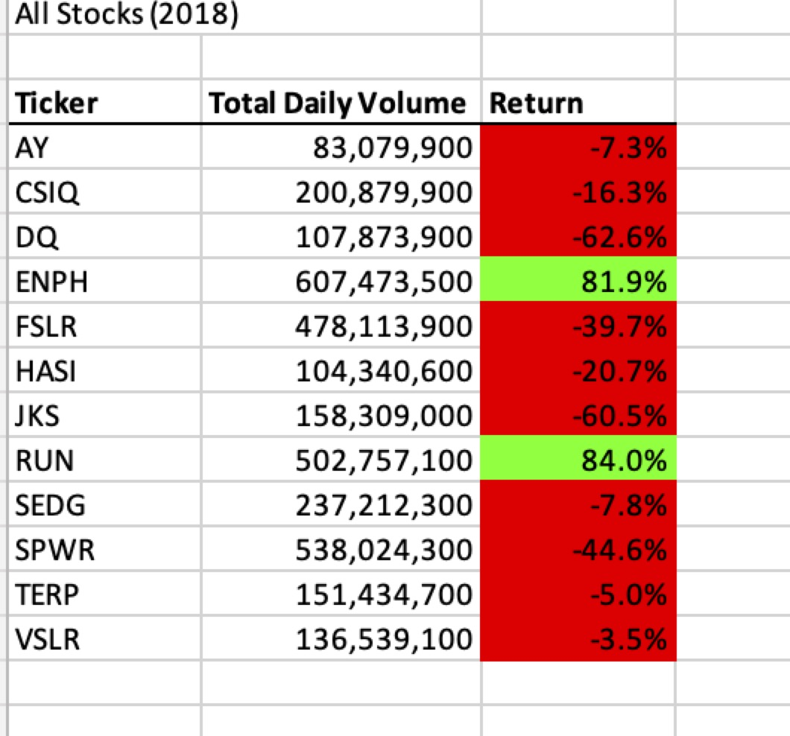
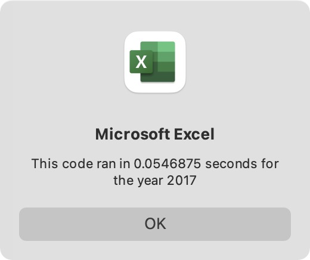

# stocks-analysis
## The purpose and background 
Steve's parents want to invest all their money to Daqo New Energy Corporation(DQ). They get all information about green energy industries in 2017 & 2018. Steve analyzes these information to find out DQ is best choice for their parents or not.
## Result 
Below graphs are the comparison of the analysis of all stock betweens 2017 and 2018. The ticker is name of each stock, and second is the number of daily trades of stocks. The "return" colunm show how many precentage that is earned or loss in the 2017 and 2018.

In 2017, the most stocks increase except TERP. DQ's return in  have the 199.45%, which is the highest increase rate in the 2017. In 2018, the green energy stocks are not favored by the market, most of them are losses except ENPH and RUN. DQ decrease 62.60% which is also highist decrease rate in 2018
Refactoring code is very important for this project,which is very effective, because it is really fast:

## Summary
According to above analysis, BQ Stock price is related the industry. If the whole green energy stocks increase, BQ increase and versa visa. Stock "ENPH" is the best option, because this stock have positive return in 2017 and 2018.
### What are the advantages or disadvantages of refactoring code?
##### Advantage:
1.Reducing the complexity, which casue code ran speed incease
2.Easy to find out the potential mistakes or bugs. 
##### Disadvantage
1.Refactoring code is big chanllege and if Without the support of a lot of knowledge and experience, reasonable solutions need to be tried repeatedly
### How do these pros and cons apply to refactoring the original VBA script?
To refactor the code, we need to check result of every change and make sure that can increase efficiency. If do well, it can reduce time of runing code.
lol
